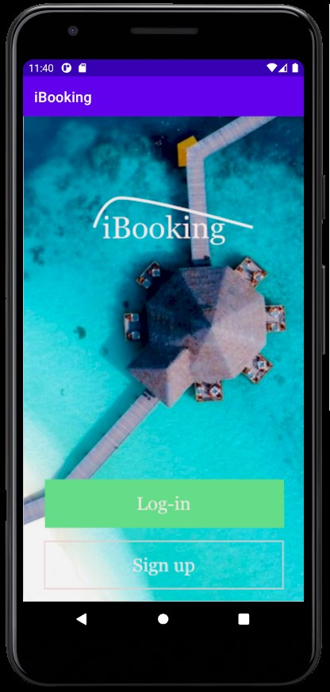
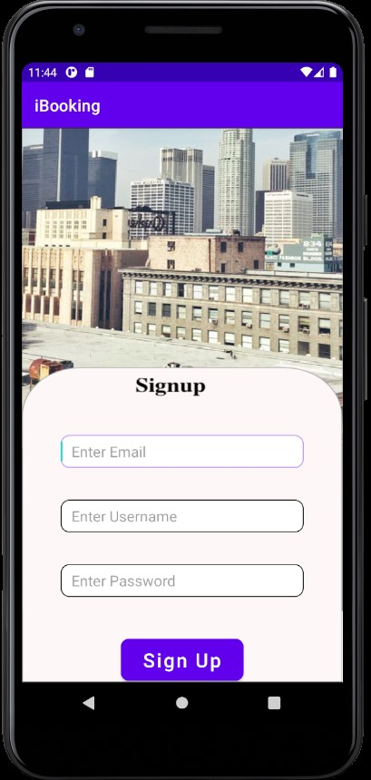
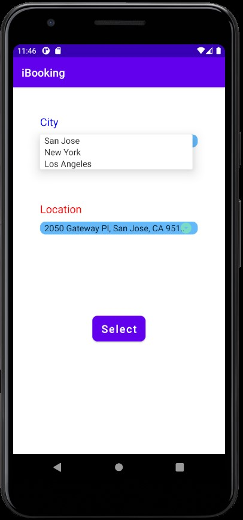
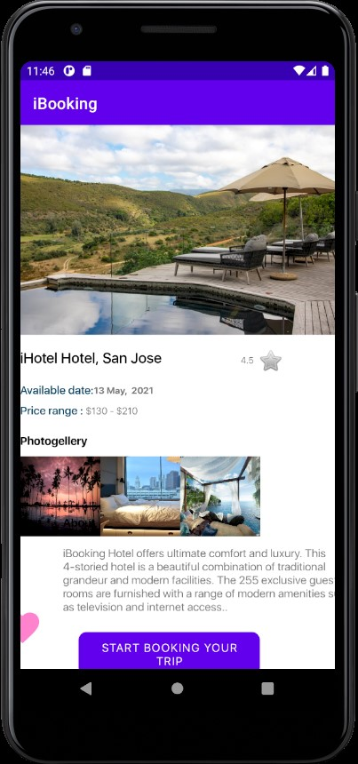
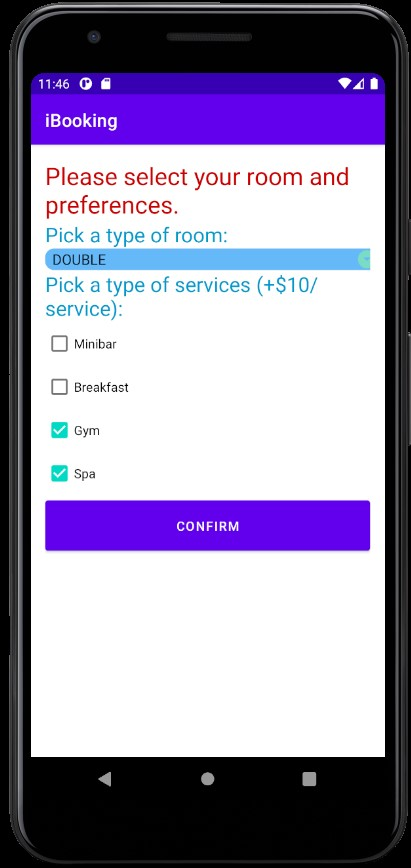
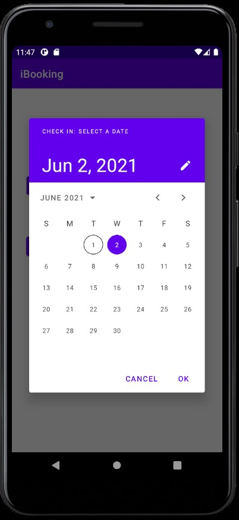
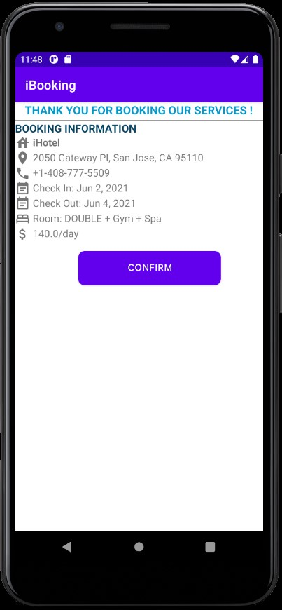
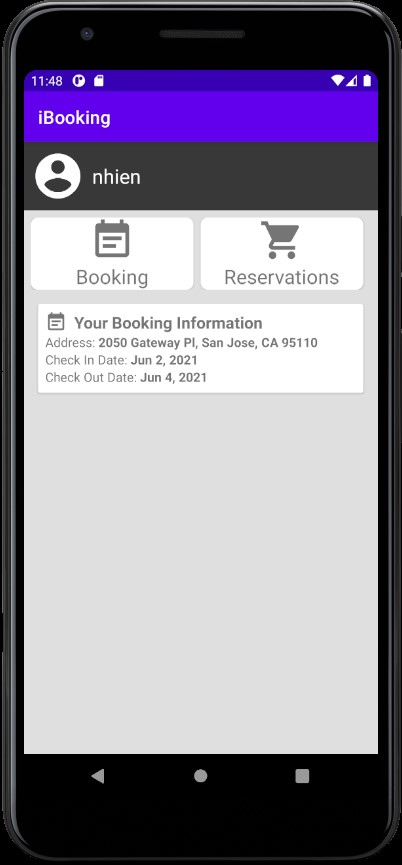

# iBooking
A Hotel Booking Android Application that allows users to make secure hotel reservations online.

Created by:
- Nhien Lam
- Thong Nguyen
- Anh Hoang
- Hung Nguyen

## Sign Up
Create an account

## Sign In

## Search Hotel
Search a hotel by address and city

## Hotel Information
Display the information of the chosen hotel

## Room Picker
Choose room types and/or extra services

## Date Picker 
Choose check-in and check-out date

## Confirmation
Review booking information and confirm

## User Homepage

